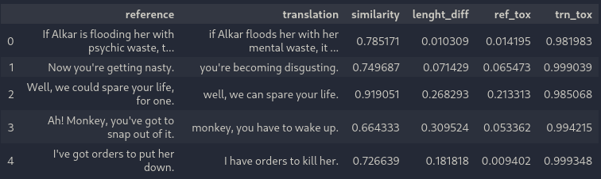
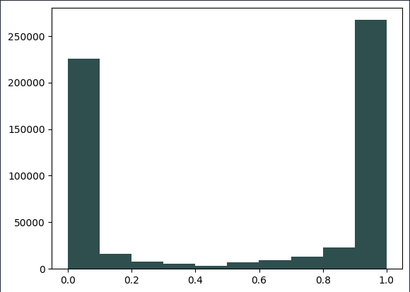
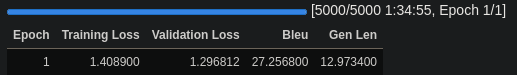

## Introduction
Text detoxification is a crucial natural language processing (NLP) task that involves identifying and correcting toxic content in textual data. In an age where online communication plays a significant role in our daily lives, it is essential to keep this communication as clean as possible. This report provides an overview of a text detoxification ML task, outlining the data analysis, model specification, training process and evaluation stage. The dataset which was used can be downloaded from [here](https://github.com/skoltech-nlp/detox/releases/download/emnlp2021/filtered_paranmt.zip).

## First steps

An overview of the dataframe:

Throughout the data exploration stage I got several insights from data visualizations:
1. The data is nearly binary (either reference is toxic or not) 

    
therefore in data preprocessing I decided to drop the references with medium level of toxicity for model to not be confused during the training stage.

2. Also I decided to drop the data where level of toxicity of translated message is higher than 0.4, because during the training stage it will be easier for model to learn some patterns of detoxification.

 

## Model selection and justification
When it came to creating a deep learning model I decided to create a solution that was as simple as possible so that I could just do preprocessing, feed that data to the model, and after training, immediately use it. The main goal was to keep it simple and get a working solution.

Eventually, I have chosen the t5-base model, because it is exteremely simple to train, flexible in terms of fine-tuning and it can be ran on machines with low performance (by setting some additional parameters).

*"T5 is an encoder-decoder model pre-trained on a multi-task mixture of unsupervised and supervised tasks and for which each task is converted into a text-to-text format. T5 works well on a variety of tasks out-of-the-box by prepending a different prefix to the input corresponding to each task, e.g., for translation: translate English to German: …, for summarization: summarize: …."*

 

## Training process 

The training phase of the model took a long time due to the lack of computational resources, the model simply could not complete the training because the process was interrupted due to lack of memory or an error that occurred after an hour of execution.

 

## Evaluation

Results of the evaluation are pretty good, especially the BLEU-score which indicates the quality of machine-generated text by comparing it to human-written text. But unfortunately it is not an ideal metric because it is unable to accurately assess phrases that have the same meaning but use different words.

 

## Results

The results indicate that the model can effectively detect and classify toxic content in text data. It successfully identifies harmful elements, including hate speech and offensive language. I think I have achieved the goals I set myself at the beginning, i.e. the model was easy to implement and train, what is more important, it is a working solution, with good metrics. 